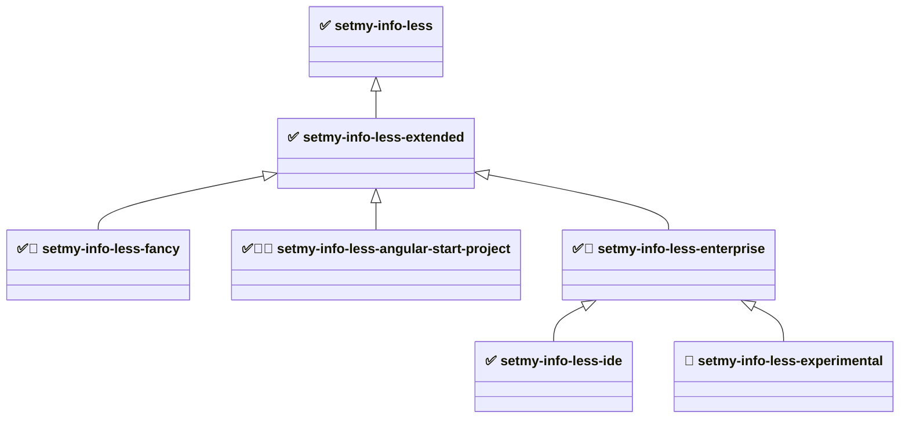

# setmy-info-less

A modular, testable, and structured LESS-based styling framework for web projects. This project provides a clean system
for managing styles with LESS, generating HTML using Pug, and ensuring quality with both unit and end-to-end tests. As
the SMI standard browser is Firefox, values can be taken directly from Firefox DevTools and unified across all browsers.

This workspace contains the following modules.

### Dependency graph



✅ stable — semver-guaranteed public API. 🧪 unstable — no guarantees. 🎯 project-specific — targeted at one known UI
project, not a general-purpose module. 🚧 skeleton — wired into the load order but emits no CSS rules yet (empty
`dist/main.min.css`). Arrows point from a module to the one it builds on: they describe **load order**, not CSS
bundling.

#### Module descriptions

- **[setmy-info-less](packages/setmy-info-less/README.md)** - Layer 0 base. The smallest CSS needed for a GUI
  environment: resets, design tokens, spacing, layout, responsive breakpoints, basic content panels/panes.
- **[setmy-info-less-extended](packages/setmy-info-less-extended/README.md)** - Layer 1. Extended content components:
  page sections, modal/overlay, cards, article typography. Kept out of base so base stays minimal.
- **[setmy-info-less-fancy](packages/setmy-info-less-fancy/README.md)** - Layer 2. Visually rich, polished patterns for
  public-facing web pages — most of the design elements for richer UI/UX work. _Audience: web designers and front-end
  developers building consumer sites._
- **[setmy-info-less-enterprise](packages/setmy-info-less-enterprise/README.md)** - Layer 2. Distribution layer for
  enterprise intranet and internal applications. _Audience: enterprise application developers._
- **[setmy-info-less-angular-start-project](packages/setmy-info-less-angular-start-project/README.md)** - Layer 2,
  project-specific. Application chrome for the Angular start template project: header panel, side navigation, modal
  overlay, footer, views, pending extraction from the Angular workspace. _Audience: developers building on the Angular
  start template project._
- **[setmy-info-less-ide](packages/setmy-info-less-ide/README.md)** - Layer 3. IDE-like (NetBeans style) developer-tool
  UI compositions; currently frame presets. _Audience: developers building browser-based IDEs, dashboards, or admin
  consoles._
- **[setmy-info-less-experimental](packages/setmy-info-less-experimental/README.md)** - Unvalidated prototypes staged
  for promotion, merge, or removal; may later move down the tree into any branch. Not for production. _Audience:
  framework developers only._ Contains:
    - `grid/` - grid layout helpers (from base `grid/`)
    - `flex/` - `smi-flex-panel` layout helpers (from extended `flex/`)
    - `base/` - button, color, color-named, key-value utilities (from base `utility/`)
    - `ui/` - interaction states, typography, card variants, feedback alerts, navigation, positioning (from the removed
      `setmy-info-less-ui`)
    - `forms/` - form element resets and layout helpers (from the removed `setmy-info-less-forms`)
    - `data/` - table styles, data display patterns, dashboard widgets (from the removed `setmy-info-less-data`)
    - `web/` - public-web chrome and content patterns (site header/nav, hero, tiles, CTA, footer, price list, media
      object, profile block, notice banner)
    - `utility/` - original experimental scratch space

### Module independence

The modules are **not** independent — they form a strict tree rooted at base, with no cycles and no dependencies between
same-tier modules. Every package follows a **standalone / delta** model: its `dist/main.css` contains **only its own
rules** and never re-emits a parent's CSS. The application selects the packages it needs and loads their stylesheets in
dependency order.

| Module                                  | Compile-time LESS imports   | Standalone CSS? | Its `dist/main.css` contains                              |
| --------------------------------------- | --------------------------- | --------------- | --------------------------------------------------------- |
| `setmy-info-less` (base)                | nothing cross-package       | ✅ yes          | resets, tokens, single-purpose utilities                  |
| `setmy-info-less-extended`              | base `values` (tokens only) | ❌ delta        | content components (section/modal/card/article)           |
| `setmy-info-less-fancy`                 | base `values` (tokens only) | ❌ delta        | (skeleton — empty for now)                                |
| `setmy-info-less-angular-start-project` | base `values` (tokens only) | ❌ delta        | (skeleton — empty for now)                                |
| `setmy-info-less-enterprise`            | base `values` (tokens only) | ❌ delta        | (skeleton — empty for now)                                |
| `setmy-info-less-ide`                   | base `values` (tokens only) | ❌ delta        | frame presets only                                        |
| `setmy-info-less-experimental`          | base `values` (tokens only) | ❌ delta        | staged prototypes (utilities, flex, patterns, web chrome) |

- **Compile-time coupling is tokens-only.** Every non-base module imports base's `values/index.less` for LESS variables
  (which emit no CSS), so none can compile without base source present — but none bundle another package's rules.
- **npm dependency = load order, LESS import = tokens.** The declared `package.json` dependencies tell you the order to
  load stylesheets in.

### Stability rules

Stable modules follow [Semantic Versioning](https://semver.org/spec/v2.0.0.html) for their public API (class names,
token names, LESS variable names): breaking changes require a major version bump, and every change is documented in
`CHANGELOG.md`. Production use is supported and encouraged.

The unstable module gives no such guarantees — class names, file layout, and import paths may change in any release. It
depends on `setmy-info-less-enterprise`, so all stable tokens and rules stay in scope, which also makes moving code
between it and any stable module straightforward. Its `ui/`, `forms/`, and `data/` subdirectories keep the names of the
removed packages they came from. Do not take a production dependency on it.

- Developer documentation: `devlopers-guide.md` (`developers-guide.md` contains the same content)
- Review notes: `review.md`, `review2.md`

## Usage

### NPM

Base module:

```shell
npm i setmy-info-less
```

- https://www.npmjs.com/package/setmy-info-less

Extended module (IDE-style frame building blocks — NetBeans look and feel):

```shell
npm i setmy-info-less-extended
```

- https://www.npmjs.com/package/setmy-info-less-extended

### Using from CDN

Base module:

```html
<link
    rel="stylesheet"
    href="https://cdn.jsdelivr.net/npm/setmy-info-less/dist/main.min.css"
/>
```

```html
<link
    rel="stylesheet"
    href="https://unpkg.com/setmy-info-less@latest/dist/main.min.css"
/>
```

Extended module:

```html
<link
    rel="stylesheet"
    href="https://cdn.jsdelivr.net/npm/setmy-info-less-extended/dist/main.min.css"
/>
```

## 📦 Project

This project includes:

- `LESS` – for modular and extendable CSS
- `Pug` – for HTML generation
- `Selenium WebDriver` – for end-to-end (E2E) testing via Selenium Grid
- `Jest` – for unit testing JavaScript
- `Express` – for local development server
- `npm scripts` – for build and test automation

**main.less** is the entry point, which includes other files in the correct order.

### CSS design principles

These principles govern every module and every new class added to the framework:

- **Token-driven.** Values come from `values/index.less` (colors, fonts, spacing, sizing, z-index)
  — do not hardcode magic numbers or colors in a rule. New categories reference existing tokens so the system stays
  consistent and themeable.
- **camelCase, behavior-first naming.** Class names describe _what the class makes the element do_, not how it looks:
  `.centerText`, `.verticalStretchPanel`, `.autoScrollBars`, `.noPadding`.
- **Three kinds of selector** (use the right one):
    - _Utility activator classes_ — attached directly to an element to turn a behavior on (`.hidden`, `.centerText`,
      `.floatLeft`, `.smi-flex-panel-row`).
    - _Modifier classes_ — suffix/companion classes that refine a base utility (`.smi-flex-panel-left`,
      `.smi-flex-panel-column`, `.phone-hidden`).
    - _Structural selectors_ — intentionally target element names or fixed DOM anchors (`html`, `body`, `main`,
      `#application`, `body.framesDefaultPadding`).
- **Conservative, old-browser-friendly layout.** Prefer floats + `.centerBox` + clearfix (`overflow: hidden`) for
  layout; do not introduce a new CSS Grid / Flexbox dependency for new work. The framework is **Firefox-first**, modern
  evergreen browsers supported, legacy browsers best-effort (see [Browser support](#browser-support)).
- **Composable and non-breaking.** New classes must compose with existing ones and must not break the
  `base` or `extended` modules. Keep the **base module minimal** — add new utility _categories_ in the higher layers
  (`extended`, `fancy`, …), not in `base`.
- **Delta packaging.** Each module's compiled CSS contains only its own rules; the consuming app composes the modules in
  dependency order (see [Module independence](#module-independence)).

### Responsive principles

UI is grouped by width. The base module targets **three screen device groups** — watch, phone and pad/desktop — each a
separate `@media only screen` block, plus a print block (no JS). The group boundaries are **640px** and **1024px**; only
the 1024px line drives the visibility utilities.

| Group             | Width          | LESS file    | Behavior                                                     |
| ----------------- | -------------- | ------------ | ------------------------------------------------------------ |
| **Watch**         | ≤ 639px        | `watch.less` | `.phone-hidden` removed; `main` height reduced by one header |
| **Phone**         | 640px – 1023px | `phone.less` | Same rules as Watch                                          |
| **Pad / desktop** | ≥ 1024px       | `pad.less`   | `.pc-hidden` removed                                         |
| **Default**       | all widths     | —            | Base (no-media-query) styles; the groups above layer on top  |
| **Print**         | print media    | `print.less` | Styles for printable documents                               |

Two responsive visibility utilities are driven by these breakpoints (exact inverses around the 1024px line):

- `.phone-hidden` — hidden **below 1024px** (Watch + Phone), visible on wide screens. Use it to drop content on small
  screens. (Hides on all small screens, not literally only phones.)
- `.pc-hidden` — hidden at **1024px and wider** (Pad / desktop), visible below 1024px. Use it for small-screen-only
  content such as a mobile menu button.

#### Targeting a device group

Each group is one plain `@media only screen` block in
[`packages/setmy-info-less/src/main/less/devices/`](packages/setmy-info-less/src/main/less/devices/) —
`watch.less`, `phone.less`, `pad.less`, `print.less` — all pulled in by `devices/index.less`. There is no JS and no
mixin layer: to target a group you write the same media query.

```less
/* Small screens only — watch + phone, i.e. everything below the 1024px line */
@media only screen and (max-width: 1023px) {
    .my-panel {
        padding: @halfDefaultPadding;
    }
}

/* Wide screens only */
@media only screen and (min-width: 1024px) {
    .my-panel {
        padding: @doubleDefaultPadding;
    }
}
```

Points worth knowing when writing responsive rules:

- **Not mobile-first.** Watch and phone are `max-width`-bounded, so a rule written for a small group never leaks upward
  into pad/desktop. Rules that should apply everywhere go outside any media block.
- **The boundary widths are literals**, not LESS tokens — `639`/`640` and `1023`/`1024` are written into the device
  files themselves. Only sizing values (`@headerHeight`, `@maxHeight`, …) come from `values/index.less`.
- **Watch and phone carry identical rules today.** They stay separate files so the two ranges can diverge later without
  disturbing the 1024px line that the visibility utilities depend on.
- **Downstream packages repeat the query.** Every package ships only its own CSS and imports base for tokens only, so a
  media block in `extended` or `ide` is written out in full rather than inherited from base.
- **Height math is token-derived.** The small-screen `main` rule resolves to `calc(@maxHeight - @headerHeight)` —
  `100%` minus the `50px` header — so changing `@defaultHeight` moves it everywhere at once.

Per-class detail and copy-paste HTML examples:
[`packages/setmy-info-less/README.md`](packages/setmy-info-less/README.md) → "Visibility utilities".

### Browser support

Firefox-first. Modern evergreen browsers (Chrome, Edge, Safari) are supported on a best-effort basis. Legacy browsers
such as Internet Explorer are not explicitly supported.

For current browser market share data see: https://gs.statcounter.com/browser-market-share

## Development

Using:

- [Semantic Versioning](https://semver.org/spec/v2.0.0.html)
- [Keep a Changelog](https://keepachangelog.com/en/1.1.0/)

### 🔧 Setup

```shell
# Install all workspace dependencies (run from the repository ROOT, never from a package)
npm install

# Or, reproducibly, from the lock file - this is the Bootstrap phase below
npm run bootstrap
```

The whole toolchain (lessc, stylelint, kss, jest, prettier, selenium-webdriver, pug) is declared **once at the
repository root** and hoisted into the single root `node_modules`. Packages declare no devDependencies of their own -
one toolchain, one version, like the `setmy.info-js` / `-python` / `-elixir` siblings.

E2E tests additionally need **Java** and an external **Selenium Grid** running before `npm run e2e-test`:

```shell
smi-selenium-hub
smi-selenium-node

export SELENIUM_HUB_URL=http://localhost:4444/wd/hub   # optional overrides
export SELENIUM_BROWSER=firefox
export SELENIUM_BROWSER_BINARY="/path/to/librewolf"     # resolved on the GRID NODE, not locally
```

## Lifecycle

This repo follows the org's shared build lifecycle: the
[Maven default lifecycle](https://maven.apache.org/guides/introduction/introduction-to-the-lifecycle.html#default-lifecycle)
phase names and ordering, implemented in npm, exactly as `setmy.info-js`, `setmy.info-python` and `setmy.info-elixir`
do. See **ADR-0045** for the maintained cross-language phase table and `setmy.info-js/requirements-rules.md` for the
language-agnostic spec. A developer moving between any of these repos - or from a Java/Maven project - uses the same
phase names in the same order.

Run from the repository root, in order:

```shell
npm run bootstrap          # npm ci
npm run clean
npm run validate
npm run format:check       # or: npm run format to auto-fix
npm run lint               # stylelint over every package's src/main/less
npm run resources -- --profile <local|dev|ci|test|prelive|live>
npm run build              # LESS -> dist/main.css + dist/main.min.css, Pug -> demo pages
npm test                   # unit tier
npm run pre-integration-test
npm run integration-test
npm run post-integration-test
npm run pre-e2e-test
npm run e2e-test           # Selenium, needs the grid above
npm run post-e2e-test
npm run coverage
npm run security
npm run verify
npm run package
npm run sbom
npm run sign
npm run install-local
npm run publish
DEPLOY_TARGET=dev npm run deploy   # target is required: dev|test|prelive|live
npm run site
```

Everything except the Selenium e2e tier has been run clean end to end on Linux/Node 24 (`EXIT 0`).

Any single phase can be run for one package only:

```shell
npm run build --workspace setmy-info-less
npm run lint --workspace setmy-info-less-ide
```

### What each phase means here

| Phase                 | LESS/CSS implementation                                                                                                                                             |
| --------------------- | ------------------------------------------------------------------------------------------------------------------------------------------------------------------- |
| Bootstrap             | `npm ci` - lockfile-exact install                                                                                                                                   |
| Clean                 | per package: `site/`, `coverage/`, `dist/styleguide/`; root: `.artifacts/`, `.deploy/`, `.signatures/`, `site/`, and it stops any test HTTP server still registered |
| Validate              | manifest structure (`main`, `style`, `files`), LESS entry point exists, `stylelint.config.js` present                                                               |
| Format / Format check | `prettier` over js/cjs/json/md/yml. **LESS formatting belongs to stylelint**, see "Known deliberate differences"                                                    |
| Lint                  | `stylelint src/main/less/**/*.less` - this module type's checkstyle equivalent                                                                                      |
| Resources             | `${token}` filtering of a package's optional `resources/` dir from `profiles/<name>.json` (ADR-0041/0042 names)                                                     |
| Compile/Build         | `lessc` → `dist/main.css` + `dist/main.min.css` (`--clean-css`), plus Pug → demo/fixture pages in `dist/`                                                           |
| Unit test             | `src/test/js/unit` via jest; the build tooling's own tests run via `node --test tools/test/unit`                                                                    |
| Integration test      | `src/test/js/integration` via jest - asserts against the **built** `dist/main.css`, never against LESS source                                                       |
| E2E test              | `src/test/js/e2e` via jest + Selenium against a real browser, with a static server started/stopped around it                                                        |
| Coverage              | jest `--coverage` over the unit tier only                                                                                                                           |
| Security              | `npm audit --audit-level=high`                                                                                                                                      |
| Verify                | both CSS artifacts exist and the rule count matches the package's declared `content`/`skeleton` expectation                                                         |
| Package               | `npm pack` into `.artifacts/<package>/`                                                                                                                             |
| SBOM / Sign           | CycloneDX-shaped JSON; SHA-256 checksums of the **packed tarball** (a labelled placeholder, not a real signature)                                                   |
| Install (local)       | installs the packed tarball (+ transitive local ones) into a throwaway project and checks the CSS really arrived                                                    |
| Publish               | branch → dist-tag, always `--dry-run` unless `PUBLISH_EXECUTE=true`                                                                                                 |
| Deploy                | writes a `prepared-not-executed` descriptor per target                                                                                                              |
| Site                  | per-package + aggregated root report site                                                                                                                           |

### Test pyramid

Maven's own `src/main` / `src/test` layout, which this repo already used:

- `src/main/less/` - the LESS sources, `main.less` is every package's single entry point
- `src/test/pug/` - Pug sources for the demo/fixture pages built into `dist/`
- `src/test/js/unit/` - unit tier (manifest/source assertions, no build output)
- `src/test/js/integration/` - integration tier, against the built `dist/main.css`
- `src/test/js/e2e/` - e2e tier, Selenium against a real browser and a running server

`pre-integration-test` / `pre-e2e-test` start a static server on the package's own port
(`config.server.port` + 1, so a manually started `npm run server` never collides), and the paired
`post-*` phases stop it - the guarantee Maven's failsafe plugin gives, and the reason `Jenkinsfile`
runs those in `post { always { ... } }`.

### Profiles and resources

`npm run resources -- --profile <name>` filters `${token}`s in a package's optional `resources/` directory using
`profiles/<name>.json`. `--profile` is required and hard-validated against exactly the six ADR-0041 canonical
environments (`local`, `dev`, `ci`, `test`, `prelive`, `live`); anything else is an error, per ADR-0042. No package
has a `resources/` directory yet, so the phase is currently a documented no-op for all seven.

### Site (reports)

`npm run site` builds `packages/<pkg>/site/` plus an aggregated root `site/index.html`, the `mvn site` equivalent:

- **Living styleguide (KSS)** - generated from the LESS source comments
- Lint report (stylelint), coverage report, security report (`npm audit`), dependency tree, SBOM link

`site/` is generated output and git-ignored.

### CI

`Jenkinsfile` (version 1.1.0, migrated from the org's `jenkinsfile-starter` 1.1.0) runs this same sequence: Inspection
→ Preparation → Build → E2E → Quality → System/Acceptance → Package → Publish → Deploy → Tag, with the same branch
gating as the three siblings - `master`, `devel*`, `release*`, `hotfix*`, and feature branches running everything up
to Package but never Publish/Deploy/Tag. The E2E stage needs the Selenium grid reachable from the agent.

### 🌐 Local development server / watch

```shell
npm run server --workspace setmy-info-less        # serves that package's dist/ on its own port
npm run stop-server --workspace setmy-info-less
npm run watch --workspace setmy-info-less         # less-watch-compiler
npm run watch:pug --workspace setmy-info-less
```

## 📤 Publishing

`npm run publish` resolves an npm dist-tag from the branch (`master` → `latest`, `release*` → `release-candidate`,
`hotfix*` → `hotfix`, `devel*` → `next`, anything else → skipped) and always runs `npm publish --dry-run` unless
`PUBLISH_EXECUTE=true` is set. Nothing in `Jenkinsfile` sets it. A version that is already on the registry is reported
as "already published - bump the version" and is **not** a build failure.

Publish order still matters (a package must exist on the registry before its dependents): base → extended → fancy →
enterprise → angular-start-project → ide → experimental. `tools/run-workspaces.js` already fans every phase out in
topological order, so running `npm run publish` from the root does this for you.

Only the CSS is published: each package's `files` allowlist is `dist/main.css`, `dist/main.min.css`, `README.md`,
`LICENSE`. The Pug demo pages and the KSS styleguide are **not** shipped any more.

## Known deliberate differences from the sibling repos / Maven

- **`dist/main.css` and `dist/main.min.css` are tracked in git** (the 1.0.0-dist decision), unlike the siblings, which
  git-ignore all generated output. `clean` therefore removes only the _other_ generated things inside `dist/` and
  leaves the two tracked CSS files for `build` to rewrite.
- **LESS files are formatted by stylelint, not prettier.** `stylelint-config-standard`'s `rule-empty-line-before` and
  prettier disagree about blank lines between rules; one formatter per language, so `.less` is in `.prettierignore`
  and `npm run lint` / `lint:fix` owns it.
- **The e2e tier needs external infrastructure** (Java + Selenium Grid) that the siblings' plain-HTTP e2e tests do
  not. It is a real browser test on purpose - CSS correctness cannot be asserted without a rendering engine.
- **Packages are versioned and released together** at one version, unlike the siblings' independent versioning.
- `sign` produces SHA-256 checksums, not real signatures; `publish`/`deploy` are prepared, not wired to real targets.

## Load order

The actual import tree as of the current codebase (`main.less` → group index → individual files):

    main.less
      values/index.less
        colors/index.less
        fonts/index.less
      html/index.less
        html.less
      utility/index.less
        visibility.less
        spacing.less
        sizing.less
        layout.less
        scroll.less
        text.less
        cursor.less
        panels.less
        visual-style.less
        notes.less
      devices/index.less
        print.less
        watch.less
        phone.less
        pad.less
      components/index.less
        application.less

## Changed

Some class names were updated after v1.0.0. If you're upgrading, search and replace as needed:

- verticalStrechPanel -> verticalStretchPanel
- horisontalStrechPanel -> horizontalStretchPanel

(+ other possible minor updates)

### Behavior changes

- `.verticalStretchPanel` and `.horizontalStretchPanel` no longer use `!important`
  (`min-height`/`height` and `min-width`/`width` are now plain declarations). These utilities can now be overridden by
  normal CSS load order and specificity. If your application relied on the old
  `!important` to force the stretch behavior over a competing rule, ensure the panel class is loaded after that rule, or
  raise its selector specificity.

## Project was created

Project creation steps and commands:

```shell
npm init --yes
npm i less --save-dev
npm i less-plugin-clean-css --save-dev
npm i less-watch-compiler --save-dev
npm i express --save-dev
npm i jest --save-dev
npm i playwright --save-dev
npm i @playwright/test@latest --save-dev
npm i pug --save-dev
npm i rimraf --save-dev
npx playwright install
```

## TODO

- Consider font correctness

```
@fontFamily: -apple-system, BlinkMacSystemFont, "Segoe UI", Roboto, "Helvetica Neue", Arial, sans-serif;

#headerPanel - > #header-panel

;
```

- Eliminate use of !important — proper load order should help avoid it.

sudo dnf install \
flite \
libavif \
libjpeg-turbo \
libmanette
