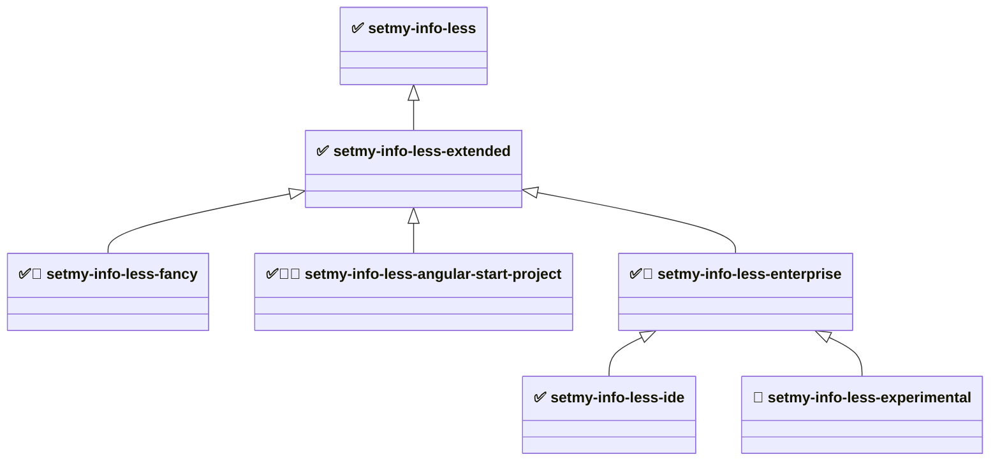

# setmy-info-less

A modular, testable, and structured LESS-based styling framework for web projects. This project provides a clean system
for managing styles with LESS, generating HTML using Pug, and ensuring quality with both unit and end-to-end tests. As
the SMI standard browser is Firefox, values can be taken directly from Firefox DevTools and unified across all browsers.

This workspace contains the following modules.

### Dependency graph



✅ stable — semver-guaranteed public API. 🧪 unstable — no guarantees. 🎯 project-specific — targeted at one known UI
project, not a general-purpose module. 🚧 skeleton — wired into the load order but emits no CSS rules yet (empty
`dist/main.min.css`). Arrows point from a module to the one it builds on: they describe **load order**, not CSS
bundling.

#### Module descriptions

* **[setmy-info-less](packages/setmy-info-less/README.md)** - Layer 0 base. The smallest CSS needed for a GUI
  environment: resets, design tokens, spacing, layout, responsive breakpoints, basic content panels/panes.
* **[setmy-info-less-extended](packages/setmy-info-less-extended/README.md)** - Layer 1. Extended content components:
  page sections, modal/overlay, cards, article typography. Kept out of base so base stays minimal.
* **[setmy-info-less-fancy](packages/setmy-info-less-fancy/README.md)** - Layer 2. Visually rich, polished patterns for
  public-facing web pages — most of the design elements for richer UI/UX work. *Audience: web designers and front-end
  developers building consumer sites.*
* **[setmy-info-less-enterprise](packages/setmy-info-less-enterprise/README.md)** - Layer 2. Distribution layer for
  enterprise intranet and internal applications. *Audience: enterprise application developers.*
* **[setmy-info-less-angular-start-project](packages/setmy-info-less-angular-start-project/README.md)** - Layer 2,
  project-specific. Application chrome for the Angular start template project: header panel, side navigation, modal
  overlay, footer, views, pending extraction from the Angular workspace. *Audience: developers building on the Angular
  start template project.*
* **[setmy-info-less-ide](packages/setmy-info-less-ide/README.md)** - Layer 3. IDE-like (NetBeans style) developer-tool
  UI compositions; currently frame presets. *Audience: developers building browser-based IDEs, dashboards, or admin
  consoles.*
* **[setmy-info-less-experimental](packages/setmy-info-less-experimental/README.md)** - Unvalidated prototypes staged
  for promotion, merge, or removal; may later move down the tree into any branch. Not for production. *Audience:
  framework developers only.* Contains:
    * `grid/` - grid layout helpers (from base `grid/`)
    * `flex/` - `smi-flex-panel` layout helpers (from extended `flex/`)
    * `base/` - button, color, color-named, key-value utilities (from base `utility/`)
    * `ui/` - interaction states, typography, card variants, feedback alerts, navigation, positioning (from the removed
      `setmy-info-less-ui`)
    * `forms/` - form element resets and layout helpers (from the removed `setmy-info-less-forms`)
    * `data/` - table styles, data display patterns, dashboard widgets (from the removed `setmy-info-less-data`)
    * `web/` - public-web chrome and content patterns (site header/nav, hero, tiles, CTA, footer, price list, media
      object, profile block, notice banner)
    * `utility/` - original experimental scratch space

### Module independence

The modules are **not** independent — they form a strict tree rooted at base, with no cycles and no dependencies between
same-tier modules. Every package follows a **standalone / delta** model: its `dist/main.css` contains **only its own
rules** and never re-emits a parent's CSS. The application selects the packages it needs and loads their stylesheets in
dependency order.

| Module                                  | Compile-time LESS imports   | Standalone CSS? | Its `dist/main.css` contains                              |
|-----------------------------------------|-----------------------------|-----------------|-----------------------------------------------------------|
| `setmy-info-less` (base)                | nothing cross-package       | ✅ yes          | resets, tokens, single-purpose utilities                  |
| `setmy-info-less-extended`              | base `values` (tokens only) | ❌ delta        | content components (section/modal/card/article)           |
| `setmy-info-less-fancy`                 | base `values` (tokens only) | ❌ delta        | (skeleton — empty for now)                                |
| `setmy-info-less-angular-start-project` | base `values` (tokens only) | ❌ delta        | (skeleton — empty for now)                                |
| `setmy-info-less-enterprise`            | base `values` (tokens only) | ❌ delta        | (skeleton — empty for now)                                |
| `setmy-info-less-ide`                   | base `values` (tokens only) | ❌ delta        | frame presets only                                        |
| `setmy-info-less-experimental`          | base `values` (tokens only) | ❌ delta        | staged prototypes (utilities, flex, patterns, web chrome) |

- **Compile-time coupling is tokens-only.** Every non-base module imports base's `values/index.less` for LESS variables
  (which emit no CSS), so none can compile without base source present — but none bundle another package's rules.
- **npm dependency = load order, LESS import = tokens.** The declared `package.json` dependencies tell you the order to
  load stylesheets in.

### Stability rules

Stable modules follow [Semantic Versioning](https://semver.org/spec/v2.0.0.html) for their public API (class names,
token names, LESS variable names): breaking changes require a major version bump, and every change is documented in
`CHANGELOG.md`. Production use is supported and encouraged.

The unstable module gives no such guarantees — class names, file layout, and import paths may change in any release. It
depends on `setmy-info-less-enterprise`, so all stable tokens and rules stay in scope, which also makes moving code
between it and any stable module straightforward. Its `ui/`, `forms/`, and `data/` subdirectories keep the names of the
removed packages they came from. Do not take a production dependency on it.

- Developer documentation: `devlopers-guide.md` (`developers-guide.md` contains the same content)
- Review notes: `review.md`, `review2.md`

## Usage

### NPM

Base module:

```shell
npm i setmy-info-less
```

* https://www.npmjs.com/package/setmy-info-less

Extended module (IDE-style frame building blocks — NetBeans look and feel):

```shell
npm i setmy-info-less-extended
```

* https://www.npmjs.com/package/setmy-info-less-extended

### Using from CDN

Base module:

```html

<link rel="stylesheet" href="https://cdn.jsdelivr.net/npm/setmy-info-less/dist/main.min.css">
```

```html

<link rel="stylesheet" href="https://unpkg.com/setmy-info-less@latest/dist/main.min.css">
```

Extended module:

```html

<link rel="stylesheet" href="https://cdn.jsdelivr.net/npm/setmy-info-less-extended/dist/main.min.css">
```

## 📦 Project

This project includes:

- `LESS` – for modular and extendable CSS
- `Pug` – for HTML generation
- `Selenium WebDriver` – for end-to-end (E2E) testing via Selenium Grid
- `Jest` – for unit testing JavaScript
- `Express` – for local development server
- `npm scripts` – for build and test automation

**main.less** is the entry point, which includes other files in the correct order.

### CSS design principles

These principles govern every module and every new class added to the framework:

- **Token-driven.** Values come from `values/index.less` (colors, fonts, spacing, sizing, z-index)
  — do not hardcode magic numbers or colors in a rule. New categories reference existing tokens so the system stays
  consistent and themeable.
- **camelCase, behavior-first naming.** Class names describe *what the class makes the element do*, not how it looks:
  `.centerText`, `.verticalStretchPanel`, `.autoScrollBars`, `.noPadding`.
- **Three kinds of selector** (use the right one):
    - *Utility activator classes* — attached directly to an element to turn a behavior on (`.hidden`, `.centerText`,
      `.floatLeft`, `.smi-flex-panel-row`).
    - *Modifier classes* — suffix/companion classes that refine a base utility (`.smi-flex-panel-left`,
      `.smi-flex-panel-column`, `.phone-hidden`).
    - *Structural selectors* — intentionally target element names or fixed DOM anchors (`html`, `body`, `main`,
      `#application`, `body.framesDefaultPadding`).
- **Conservative, old-browser-friendly layout.** Prefer floats + `.centerBox` + clearfix (`overflow: hidden`) for
  layout; do not introduce a new CSS Grid / Flexbox dependency for new work. The framework is **Firefox-first**, modern
  evergreen browsers supported, legacy browsers best-effort (see [Browser support](#browser-support)).
- **Composable and non-breaking.** New classes must compose with existing ones and must not break the
  `base` or `extended` modules. Keep the **base module minimal** — add new utility *categories* in the higher layers
  (`extended`, `fancy`, …), not in `base`.
- **Delta packaging.** Each module's compiled CSS contains only its own rules; the consuming app composes the modules in
  dependency order (see [Module independence](#module-independence)).

### Responsive principles

UI is grouped by width. The base module targets **three screen device groups** — watch, phone and pad/desktop — each a
separate `@media only screen` block, plus a print block (no JS). The group boundaries are **640px** and **1024px**; only
the 1024px line drives the visibility utilities.

| Group             | Width          | LESS file    | Behavior                                                     |
|-------------------|----------------|--------------|--------------------------------------------------------------|
| **Watch**         | ≤ 639px        | `watch.less` | `.phone-hidden` removed; `main` height reduced by one header |
| **Phone**         | 640px – 1023px | `phone.less` | Same rules as Watch                                          |
| **Pad / desktop** | ≥ 1024px       | `pad.less`   | `.pc-hidden` removed                                         |
| **Default**       | all widths     | —            | Base (no-media-query) styles; the groups above layer on top  |
| **Print**         | print media    | `print.less` | Styles for printable documents                               |

Two responsive visibility utilities are driven by these breakpoints (exact inverses around the 1024px line):

* `.phone-hidden` — hidden **below 1024px** (Watch + Phone), visible on wide screens. Use it to drop content on small
  screens. (Hides on all small screens, not literally only phones.)
* `.pc-hidden` — hidden at **1024px and wider** (Pad / desktop), visible below 1024px. Use it for small-screen-only
  content such as a mobile menu button.

#### Targeting a device group

Each group is one plain `@media only screen` block in
[`packages/setmy-info-less/src/main/less/devices/`](packages/setmy-info-less/src/main/less/devices/) —
`watch.less`, `phone.less`, `pad.less`, `print.less` — all pulled in by `devices/index.less`. There is no JS and no
mixin layer: to target a group you write the same media query.

```less
/* Small screens only — watch + phone, i.e. everything below the 1024px line */
@media only screen and (max-width: 1023px) {
    .my-panel {
        padding: @halfDefaultPadding;
    }
}

/* Wide screens only */
@media only screen and (min-width: 1024px) {
    .my-panel {
        padding: @doubleDefaultPadding;
    }
}
```

Points worth knowing when writing responsive rules:

* **Not mobile-first.** Watch and phone are `max-width`-bounded, so a rule written for a small group never leaks upward
  into pad/desktop. Rules that should apply everywhere go outside any media block.
* **The boundary widths are literals**, not LESS tokens — `639`/`640` and `1023`/`1024` are written into the device
  files themselves. Only sizing values (`@headerHeight`, `@maxHeight`, …) come from `values/index.less`.
* **Watch and phone carry identical rules today.** They stay separate files so the two ranges can diverge later without
  disturbing the 1024px line that the visibility utilities depend on.
* **Downstream packages repeat the query.** Every package ships only its own CSS and imports base for tokens only, so a
  media block in `extended` or `ide` is written out in full rather than inherited from base.
* **Height math is token-derived.** The small-screen `main` rule resolves to `calc(@maxHeight - @headerHeight)` —
  `100%` minus the `50px` header — so changing `@defaultHeight` moves it everywhere at once.

Per-class detail and copy-paste HTML examples:
[`packages/setmy-info-less/README.md`](packages/setmy-info-less/README.md) → "Visibility utilities".

### Browser support

Firefox-first. Modern evergreen browsers (Chrome, Edge, Safari) are supported on a best-effort basis. Legacy browsers
such as Internet Explorer are not explicitly supported.

For current browser market share data see: https://gs.statcounter.com/browser-market-share

## Development

Using:

* [Semantic Versioning](https://semver.org/spec/v2.0.0.html)
* [Keep a Changelog](https://keepachangelog.com/en/1.1.0/)

### 🔧 Setup

Complete setup in order — all prerequisites first, then install.

#### 1. System prerequisites

Java is required to run the Selenium Grid hub and node:

```shell
# Verify Java is available
java -version
```

KSS styleguide generation uses the `kss` CLI from the `kss` npm package (v3.x). It is installed automatically by
`npm install` as a devDependency — no separate global install needed.

#### 2. Selenium Grid

E2E tests run against an external Selenium Grid. Start the hub and node **before** running
`npm run e2e` or `npm run verify`:

```shell
smi-selenium-hub
smi-selenium-node
```

Override the hub URL or browser via environment variables if your grid differs from the defaults:

```shell
export SELENIUM_HUB_URL=http://localhost:4444/wd/hub
export SELENIUM_BROWSER=firefox
```

To drive a specific Gecko-based browser binary instead of the node's default Firefox — for example
LibreWolf, which has no Terms-of-Use screen — point `SELENIUM_BROWSER_BINARY` at the executable. The
path is resolved **on the grid node**, not on the machine running Jest:

```shell
export SELENIUM_BROWSER_BINARY="C:\pub\librewolf-153.0.4-1\LibreWolf\librewolf.exe"
```

#### 3. Node dependencies

All workspace packages share the single `node_modules` tree at the repository root. Always run install from the root
directory, not from inside a package folder:

```shell
# Install all workspace dependencies (run from repository root)
npm install

# Or install strictly from the lock file — recommended for CI environments
npm ci
```

## Upgrade packages

All commands below must be run from the **repository root**.

```shell
# Check which packages have newer versions available (includes root and all workspaces)
npx npm-check-updates --workspaces --root

# Write updated versions into all package.json files
npx npm-check-updates -u --workspaces --root

# Or update a single workspace only
npx npm-check-updates -u --workspace setmy-info-less

# Install the updated versions
npm install

# Check for security vulnerabilities across all packages
npm audit

# Fix automatically fixable vulnerabilities
npm audit fix

# Force-fix remaining vulnerabilities — review the diff before committing
npm audit fix --force
```

Useful workspace commands:

```shell
npm run build --workspaces

npm run css --workspace setmy-info-less
npm run css --workspace setmy-info-less-extended
npm run css --workspace setmy-info-less-angular-start-project
#npm run css --workspace setmy-info-less-fancy
#npm run css --workspace setmy-info-less-enterprise
npm run css --workspace setmy-info-less-ide
npm run css --workspace setmy-info-less-experimental

npm run css-min --workspace setmy-info-less
npm run css-min --workspace setmy-info-less-extended
npm run css-min --workspace setmy-info-less-angular-start-project
#npm run css-min --workspace setmy-info-less-fancy
#npm run css-min --workspace setmy-info-less-enterprise
npm run css-min --workspace setmy-info-less-ide
npm run css-min --workspace setmy-info-less-experimental

npm run html --workspace setmy-info-less
```

### LESS to CSS transpiling

```shell
npm run css --workspaces
npm run css-min --workspaces
```

### Pug to HTML transpiling

```shell
npm run html --workspaces
```

### Full build

```shell
# Build all workspaces (npm processes them in alphabetical order: base before extended)
# This builds CSS, minified CSS, example HTML, and KSS styleguides.
npm run build --workspaces

# Or build each workspace explicitly in dependency order
npm run build --workspace setmy-info-less
npm run build --workspace setmy-info-less-extended
#npm run build --workspace setmy-info-less-fancy
npm run build --workspace setmy-info-less-angular-start-project
#npm run build --workspace setmy-info-less-enterprise
npm run build --workspace setmy-info-less-ide
npm run build --workspace setmy-info-less-experimental
```

### Styleguide generation

Uses `kss` (from the `kss@3.x` devDependency). The binary is in `node_modules/.bin/kss`
and is called automatically by `npm run build` and `npm run styleguide`.

```shell
# Generate only the KSS styleguides without rerunning the rest of the build
npm run styleguide --workspaces
```

### 🧪 Test execution

Currently, no useful unit tests, just working placeholder.

#### Unit test execution

```shell
npm test --workspaces
```

### E2E test execution

Requires Selenium Grid running at `http://localhost:4444/wd/hub` (or override via `SELENIUM_HUB_URL`). Each package
starts its own HTTP server on a random port for the duration of the test run. Tests within a package run serially
(`maxWorkers: 1`) to prevent session collisions.

```shell
npm run e2e --workspaces
```

#### Test infrastructure notes

- **`setmy-info-less-enterprise` is a placeholder, verified by lint only.** It currently has no rules of its own and no
  e2e suite; its `verify` runs `lint:less`. The repository-root
  `npm run smoke:dist` treats it as an intentional skeleton (zero rules allowed). Add tests when it gains real content.
- **Retained legacy test files (kept on purpose, not used).** `packages/common/test/js/firefoxHelper.js`
  and the per-package `playwright.config.js` stubs are leftovers from the Playwright era. The suite now runs on an
  external Selenium Grid via the Jest runner, so these are unused — they are retained as migration markers and
  documented in-file rather than removed.

### Specific E2E test execution

```shell
# Run all e2e tests in one package
npm run e2e --workspace setmy-info-less

# Run a single test file by name pattern
npm run e2e:one --workspace setmy-info-less -- --testPathPattern=application
```

### Check LESS style

```shell
npm run lint:less --workspaces
```

### Fix LESS style

```shell
npm run lint:fix-less --workspaces
```

### Combined test execution

```shell
npm run verify --workspaces
```

### 🌐 Local Development Server

```shell
npm start --workspace setmy-info-less
```

### 🔄 Watch for changes

```shell
npm run watch --workspace setmy-info-less
```

### 📦 Packaging

```shell
npm pack --workspaces
npm pack --dry-run --workspaces
```

### 🧹 Cleaning

### Dist folder removal

```shell
npm run clean --workspaces
```

### Clean project removal

```shell
npm run clean:all --workspaces
```

### 🏗 Full build for CI and build checkup

```shell
# Clean, install, build, verify, and pack — run from repository root
# This workflow includes KSS styleguide generation via each workspace build script.
# `npm run smoke:dist` checks every package produced a dist/main.css and that content packages
# are non-empty (intentional skeletons are allowed to be empty).
npm run clean:all --workspaces && npm install && npm run build --workspaces && npm run smoke:dist && npm run verify --workspaces && npm pack --workspaces && npm pack --dry-run --workspaces
```

## 📤 Publishing

Login to npm:

```shell
npm login
```

Dry run:

```shell
npm pack --workspaces --dry-run
```

Publish in dependency order. Each package's `package.json` declares its npm dependencies, so a package must be published
only after every package it depends on already exists on the registry.

Declared dependency edges (from each `package.json`):

| Package                                 | Depends on (npm `dependencies`)               |
|-----------------------------------------|-----------------------------------------------|
| `setmy-info-less`                       | — (none, Layer 0 base)                        |
| `setmy-info-less-extended`              | `setmy-info-less`                             |
| `setmy-info-less-angular-start-project` | `setmy-info-less-extended`                    |
| `setmy-info-less-fancy`                 | `setmy-info-less-extended`                    |
| `setmy-info-less-enterprise`            | `setmy-info-less`, `setmy-info-less-extended` |
| `setmy-info-less-ide`                   | `setmy-info-less-enterprise`                  |
| `setmy-info-less-experimental`          | `setmy-info-less-enterprise`                  |

A valid topological publishing order (every dependency precedes its dependents):

```shell
npm publish --workspace setmy-info-less
npm publish --workspace setmy-info-less-extended
#npm publish --workspace setmy-info-less-angular-start-project
#npm publish --workspace setmy-info-less-fancy
#npm publish --workspace setmy-info-less-enterprise
npm publish --workspace setmy-info-less-ide
npm publish --workspace setmy-info-less-experimental
```

> Note: `setmy-info-less-experimental` is not intended for public consumption — publish it only if
> internal distribution requires it.

Or publish all at once (only safe when every dependency's current version is already on npm from a previous release):

```shell
npm publish --workspaces
```

### Build vs. publish order

The two orders are governed by different mechanisms — do not conflate them:

- **Build order is not significant.** Each package's `lessc` step reads its dependencies' LESS **source** directly via
  relative `@import url("../../../../<pkg>/src/main/less/...")`, not their built `dist/`. So
  `npm run build --workspaces` succeeds regardless of the order npm iterates the workspaces (alphabetical: base,
  enterprise, experimental, extended, fancy, ide). No package's build depends on another package's `dist/` existing
  first.
- **Publish order is significant** and must follow the table above, because `npm install` of a dependent resolves its
  declared `dependencies` from the registry.

### Publishing only the packages that have content

Some packages are currently **empty skeletons** (zero CSS rules) and should not be published yet. Run
`npm run smoke:dist` to see which have content:

| Package                                 | Has rules?        | Publish?                            |
|-----------------------------------------|-------------------|-------------------------------------|
| `setmy-info-less`                       | ✅ yes            | ✅ publish                          |
| `setmy-info-less-extended`              | ✅ yes            | ✅ publish                          |
| `setmy-info-less-ide`                   | ✅ yes            | ✅ publish (see dependency note)    |
| `setmy-info-less-experimental`          | ✅ yes            | ⚠️ internal only — keep unpublished |
| `setmy-info-less-angular-start-project` | ❌ empty skeleton | ⏸ skip until it has rules           |
| `setmy-info-less-fancy`                 | ❌ empty skeleton | ⏸ skip until it has rules           |
| `setmy-info-less-enterprise`            | ❌ empty skeleton | ⏸ skip until it has rules           |

**1. Block accidental publishes.** Mark the packages you are *not* publishing as private so
`npm publish --workspaces` skips them (and a stray `npm publish` is refused):

```jsonc
// packages/setmy-info-less-angular-start-project/package.json, -fancy, -enterprise, -experimental
{ "private": true }
```

Remove `"private": true` later, when a package gains real rules and you want to ship it.

**2. Resolve the `ide → enterprise` dependency.** `setmy-info-less-ide` declares a dependency on the empty
`setmy-info-less-enterprise`, so a consumer installing `ide` needs `enterprise` on the registry. Pick one:

- **Re-point the dependency (recommended):** change `ide`'s dependency from `setmy-info-less-enterprise`
  to `setmy-info-less` (its real compile/runtime need under the delta model). Then `ide` publishes without the empty
  placeholder.
- **Or publish the empty placeholder:** ship `setmy-info-less-enterprise` too (an empty but valid package) so `ide`'s
  declared dependency resolves.

**3. Restrict tarball contents.** Add a `files` allow-list so only built CSS ships (not `src/`, tests, or configs):

```jsonc
{ "files": ["dist", "README.md"] }
```

**4. Build fresh, then dry-run, then publish in dependency order:**

```shell
# from repository root
npm run clean:all --workspaces && npm install && npm run build --workspaces && npm run smoke:dist

# inspect exactly what each tarball will contain
npm pack --dry-run --workspace setmy-info-less
npm pack --dry-run --workspace setmy-info-less-extended
npm pack --dry-run --workspace setmy-info-less-ide

# log in once, then publish base → extended → ide (dependency order)
npm login
npm publish --workspace setmy-info-less
npm publish --workspace setmy-info-less-extended
npm publish --workspace setmy-info-less-ide
#npm publish --workspace setmy-info-less-angular-start-project
```

`npm publish --workspaces` (all at once) is only safe once every published package's dependencies are already on the
registry **and** the skeletons are marked `private` — otherwise it will try to publish the empty packages or fail on the
unresolved `enterprise` dependency.

## Load order

The actual import tree as of the current codebase (`main.less` → group index → individual files):

    main.less
      values/index.less
        colors/index.less
        fonts/index.less
      html/index.less
        html.less
      utility/index.less
        visibility.less
        spacing.less
        sizing.less
        layout.less
        scroll.less
        text.less
        cursor.less
        panels.less
        visual-style.less
        notes.less
      devices/index.less
        print.less
        watch.less
        phone.less
        pad.less
      components/index.less
        application.less

## Changed

Some class names were updated after v1.0.0. If you're upgrading, search and replace as needed:

* verticalStrechPanel -> verticalStretchPanel
* horisontalStrechPanel -> horizontalStretchPanel

(+ other possible minor updates)

### Behavior changes

* `.verticalStretchPanel` and `.horizontalStretchPanel` no longer use `!important`
  (`min-height`/`height` and `min-width`/`width` are now plain declarations). These utilities can now be overridden by
  normal CSS load order and specificity. If your application relied on the old
  `!important` to force the stretch behavior over a competing rule, ensure the panel class is loaded after that rule, or
  raise its selector specificity.

## Project was created

Project creation steps and commands:

```shell
npm init --yes
npm i less --save-dev
npm i less-plugin-clean-css --save-dev
npm i less-watch-compiler --save-dev
npm i express --save-dev
npm i jest --save-dev
npm i playwright --save-dev
npm i @playwright/test@latest --save-dev
npm i pug --save-dev
npm i rimraf --save-dev
npx playwright install
```

## TODO

* Consider font correctness

```
@fontFamily: -apple-system, BlinkMacSystemFont, "Segoe UI", Roboto, "Helvetica Neue", Arial, sans-serif;

#headerPanel - > #header-panel

;
```

* Eliminate use of !important — proper load order should help avoid it.

sudo dnf install \
flite \
libavif \
libjpeg-turbo \
libmanette
