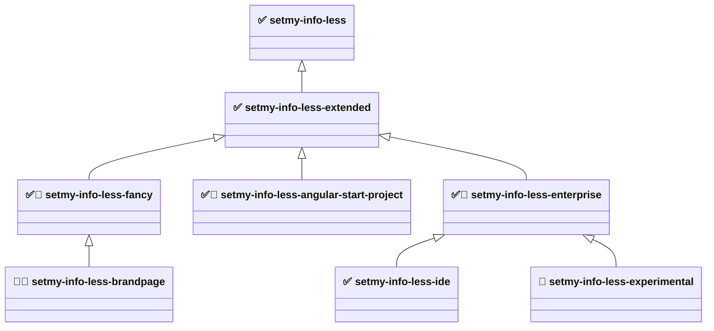

# setmy-info-less

A modular, testable, and structured LESS-based styling framework for web projects. This project provides a clean system
for managing styles with LESS, generating HTML using Pug, and ensuring quality with both unit and end-to-end tests. As
the SMI standard browser is Firefox, values can be taken directly from Firefox DevTools and unified across all browsers.

This workspace contains the following modules.

## Development

- node v24.19.0
- npm 11.17.0

### Lifecycle

This repo follows the org template family (JS, Python, Elixir, LESS, jenkinsfile-starter)
Run from the repository root, in order:

```shell
npm install
npm run audit
npm audit fix
npm ci
npm ls --all
npm run clean
#npm run format:check # sequential check: prettier on LESS, then prettier on the rest (CI)
#npm run format                           # same list, write
npm run build                          # lessc per package -> dist/main.css + dist/main.min.css
npm run verify                         # CSS artifacts
npm test                               # unit tier
npm run pre-integration-test
npm run integration-test
npm run post-integration-test
#smi-selenium-hub
#smi-selenium-node
npm run pre-e2e-test                   # serves each package's built dist/; needs a Selenium Grid
npm run e2e-test
npm run post-e2e-test
npm run coverage                       # unit tier only (Selenium stays out of coverage)
#npm run lint
npm run audit
npm audit fix
npm run reports
npm run docs
npm run package                        # dist/*.tgz, one tarball per package
npm run deploy -- <dev|test|prelive|live>
npm run release                        # devel* -> -SNAPSHOT to the snapshot registry; master -> release to the release registry

npm pkg fix --workspaces

npm login
npm publish --workspaces --dry-run
npm publish --workspaces

npm run server --workspace setmy-info-less        # serves that package's dist/ on its own port
npm run stop-server --workspace setmy-info-less
npm run watch --workspace setmy-info-less         # less-watch-compiler
npm run watch:pug --workspace setmy-info-less

npm i setmy-info-less
npm run build --workspace setmy-info-less
npm run lint --workspace setmy-info-less-ide
```

### Dependency graph



✅ stable — semver-guaranteed public API. 🧪 unstable — no guarantees. 🎯 project-specific — targeted at one known UI
project, not a general-purpose module. 🚧 skeleton — wired into the load order but emits no CSS rules yet (empty
`dist/main.min.css`). Arrows point from a module to the one it builds on: they describe **load order**, not CSS
bundling.

#### Module descriptions

- **[setmy-info-less](packages/setmy-info-less/README.md)** - Layer 0 base. The smallest CSS needed for a GUI
  environment: resets, design tokens, spacing, layout, responsive breakpoints, basic content panels/panes.
- **[setmy-info-less-extended](packages/setmy-info-less-extended/README.md)** - Layer 1. Extended content components:
  page sections, modal/overlay, cards, article typography. Kept out of base so base stays minimal.
- **[setmy-info-less-fancy](packages/setmy-info-less-fancy/README.md)** - Layer 2. Visually rich, polished patterns for
  public-facing web pages — most of the design elements for richer UI/UX work. _Audience: web designers and front-end
  developers building consumer sites._
- **[setmy-info-less-brandpage](packages/setmy-info-less-brandpage/README.md)** - Layer 3, targeted, unstable.
  LESS/CSS collection for fancy, nice looking, wide-variety UI/UX brand pages — the CSS of one specific brand page
  created for product promo and advertisement. Holds the setmy.info brand site CSS: `brand/` is one directory per part
  of the page, `pages/` says which parts each page uses and in which order. _Audience: designers and front-end
  developers building brand, promo, and advertisement pages._
- **[setmy-info-less-enterprise](packages/setmy-info-less-enterprise/README.md)** - Layer 2. Distribution layer for
  enterprise intranet and internal applications. _Audience: enterprise application developers._
- **[setmy-info-less-angular-start-project](packages/setmy-info-less-angular-start-project/README.md)** - Layer 2,
  project-specific. Application chrome for the Angular start template project: header panel, side navigation, modal
  overlay, footer, views. `src/main/less/components/` mirrors the Angular workspace's `src/app/components/` tree file
  for file, so LESS moves between the two projects unchanged. _Audience: developers building on the Angular start
  template project._
- **[setmy-info-less-ide](packages/setmy-info-less-ide/README.md)** - Layer 3. IDE-like (NetBeans style) developer-tool
  UI compositions; currently frame presets. _Audience: developers building browser-based IDEs, dashboards, or admin
  consoles._
- **[setmy-info-less-experimental](packages/setmy-info-less-experimental/README.md)** - Unvalidated prototypes staged
  for promotion, merge, or removal; may later move down the tree into any branch. Not for production. _Audience:
  framework developers only._ Contains:
    - `grid/` - grid layout helpers (from base `grid/`)
    - `flex/` - `smi-flex-panel` layout helpers (from extended `flex/`)
    - `base/` - button, color, color-named, key-value utilities (from base `utility/`)
    - `ui/` - interaction states, typography, card variants, feedback alerts, navigation, positioning (from the removed
      `setmy-info-less-ui`)
    - `forms/` - form element resets and layout helpers (from the removed `setmy-info-less-forms`)
    - `data/` - table styles, data display patterns, dashboard widgets (from the removed `setmy-info-less-data`)
    - `web/` - public-web chrome and content patterns (site header/nav, hero, tiles, CTA, footer, price list, media
      object, profile block, notice banner)
    - `utility/` - original experimental scratch space

### Module independence

The modules are **not** independent — they form a strict tree rooted at base, with no cycles and no dependencies between
same-tier modules. Every package follows a **standalone / delta** model: its `dist/main.css` contains **only its own
rules** and never re-emits a parent's CSS. The application selects the packages it needs and loads their stylesheets in
dependency order.

| Module                                  | Compile-time LESS imports   | Standalone CSS? | Its `dist/main.css` contains                              |
| --------------------------------------- | --------------------------- | --------------- | --------------------------------------------------------- |
| `setmy-info-less` (base)                | nothing cross-package       | ✅ yes          | resets, tokens, single-purpose utilities                  |
| `setmy-info-less-extended`              | base `values` (tokens only) | ❌ delta        | content components (section/modal/card/article)           |
| `setmy-info-less-fancy`                 | base `values` (tokens only) | ❌ delta        | (skeleton — empty for now)                                |
| `setmy-info-less-brandpage`             | base `values` (tokens only) | ❌ delta        | brand page chrome, panels, slogan rows, overlays          |
| `setmy-info-less-angular-start-project` | base `values` (tokens only) | ❌ delta        | application chrome and view styles (components/)          |
| `setmy-info-less-enterprise`            | base `values` (tokens only) | ❌ delta        | (skeleton — empty for now)                                |
| `setmy-info-less-ide`                   | base `values` (tokens only) | ❌ delta        | frame presets only                                        |
| `setmy-info-less-experimental`          | base `values` (tokens only) | ❌ delta        | staged prototypes (utilities, flex, patterns, web chrome) |

- **Compile-time coupling is tokens-only.** Every non-base module imports base's `values/index.less` for LESS variables
  (which emit no CSS), so none can compile without base source present — but none bundle another package's rules.
- **npm dependency = load order, LESS import = tokens.** The declared `package.json` dependencies tell you the order to
  load stylesheets in.

### Stability rules

Stable modules follow [Semantic Versioning](https://semver.org/spec/v2.0.0.html) for their public API (class names,
token names, LESS variable names): breaking changes require a major version bump, and every change is documented in
`CHANGELOG.md`. Production use is supported and encouraged.

The unstable modules give no such guarantees — class names, file layout, and import paths may change in any release. Do
not take a production dependency on them.

<<<<<<< Updated upstream
`setmy-info-less-experimental` depends on `setmy-info-less-enterprise`, so all stable tokens and rules stay in scope,
which also makes moving code between it and any stable module straightforward. Its `ui/`, `forms/`, and `data/`
subdirectories keep the names of the removed packages they came from.

`setmy-info-less-brandpage` depends on `setmy-info-less-fancy` and is under development: it is the destination for the
LESS/CSS of the existing targeted brand pages, which is moved in step by step — the setmy.info brand site is in. It
stays unstable until that migration settles.

- Developer documentation: `DEVELOPERS-GUIDE.md`
- Review notes: `review.md`, `review3.md` (historical)
=======
- Developer documentation: `DEVELOPERS-GUIDE.md`
>>>>>>> Stashed changes

## Usage

- https://www.npmjs.com/package/setmy-info-less

Extended module (IDE-style frame building blocks — NetBeans look and feel):

```shell
npm i setmy-info-less-extended
```

- https://www.npmjs.com/package/setmy-info-less-extended

### Using from CDN

Base module:

```html
<link
    rel="stylesheet"
    href="https://cdn.jsdelivr.net/npm/setmy-info-less/dist/main.min.css"
/>
```

```html
<link
    rel="stylesheet"
    href="https://unpkg.com/setmy-info-less@latest/dist/main.min.css"
/>
```

Extended module:

```html
<link
    rel="stylesheet"
    href="https://cdn.jsdelivr.net/npm/setmy-info-less-extended/dist/main.min.css"
/>
```

## 📦 Project

This project includes:

- `LESS` – for modular and extendable CSS
- `Pug` – for HTML generation
- `Selenium WebDriver` – for end-to-end (E2E) testing via Selenium Grid
- `Jest` – for unit testing JavaScript
- `Express` – for local development server
- `npm scripts` – for build and test automation

**main.less** is the entry point, which includes other files in the correct order.

### CSS design principles

These principles govern every module and every new class added to the framework:

- **Token-driven.** Values come from `values/index.less` (colors, fonts, spacing, sizing, z-index)
  — do not hardcode magic numbers or colors in a rule. New categories reference existing tokens so the system stays
  consistent and themeable.
- **camelCase, behavior-first naming.** Class names describe _what the class makes the element do_, not how it looks:
  `.centerText`, `.verticalStretchPanel`, `.autoScrollBars`, `.noPadding`.
- **Three kinds of selector** (use the right one):
    - _Utility activator classes_ — attached directly to an element to turn a behavior on (`.hidden`, `.centerText`,
      `.floatLeft`, `.smi-flex-panel-row`).
    - _Modifier classes_ — suffix/companion classes that refine a base utility (`.smi-flex-panel-left`,
      `.smi-flex-panel-column`, `.phone-hidden`).
    - _Structural selectors_ — intentionally target element names or fixed DOM anchors (`html`, `body`, `main`,
      `#application`, `body.framesDefaultPadding`).
- **Conservative, old-browser-friendly layout.** Prefer floats + `.centerBox` + clearfix (`overflow: hidden`) for
  layout; do not introduce a new CSS Grid / Flexbox dependency for new work. The framework is **Firefox-first**, modern
  evergreen browsers supported, legacy browsers best-effort (see [Browser support](#browser-support)).
- **Composable and non-breaking.** New classes must compose with existing ones and must not break the
  `base` or `extended` modules. Keep the **base module minimal** — add new utility _categories_ in the higher layers
  (`extended`, `fancy`, …), not in `base`.
- **Delta packaging.** Each module's compiled CSS contains only its own rules; the consuming app composes the modules in
  dependency order (see [Module independence](#module-independence)).

### Responsive principles

UI is grouped by width. The base module targets **three screen device groups** — watch, phone and pad/desktop — each a
separate `@media only screen` block, plus a print block (no JS). The group boundaries are **640px** and **1024px**; only
the 1024px line drives the visibility utilities.

| Group             | Width          | LESS file    | Behavior                                                     |
| ----------------- | -------------- | ------------ | ------------------------------------------------------------ |
| **Watch**         | ≤ 639px        | `watch.less` | `.phone-hidden` removed; `main` height reduced by one header |
| **Phone**         | 640px – 1023px | `phone.less` | Same rules as Watch                                          |
| **Pad / desktop** | ≥ 1024px       | `pad.less`   | `.pc-hidden` removed                                         |
| **Default**       | all widths     | —            | Base (no-media-query) styles; the groups above layer on top  |
| **Print**         | print media    | `print.less` | Styles for printable documents                               |

Two responsive visibility utilities are driven by these breakpoints (exact inverses around the 1024px line):

- `.phone-hidden` — hidden **below 1024px** (Watch + Phone), visible on wide screens. Use it to drop content on small
  screens. (Hides on all small screens, not literally only phones.)
- `.pc-hidden` — hidden at **1024px and wider** (Pad / desktop), visible below 1024px. Use it for small-screen-only
  content such as a mobile menu button.

#### Targeting a device group

Each group is one plain `@media only screen` block in
[`packages/setmy-info-less/src/main/less/devices/`](packages/setmy-info-less/src/main/less/devices/) —
`watch.less`, `phone.less`, `pad.less`, `print.less` — all pulled in by `devices/index.less`. There is no JS and no
mixin layer: to target a group you write the same media query.

```less
/* Small screens only — watch + phone, i.e. everything below the 1024px line */
@media only screen and (max-width: 1023px) {
    .my-panel {
        padding: @halfDefaultPadding;
    }
}

/* Wide screens only */
@media only screen and (min-width: 1024px) {
    .my-panel {
        padding: @doubleDefaultPadding;
    }
}
```

Points worth knowing when writing responsive rules:

- **Not mobile-first.** Watch and phone are `max-width`-bounded, so a rule written for a small group never leaks upward
  into pad/desktop. Rules that should apply everywhere go outside any media block.
- **The boundary widths are literals**, not LESS tokens — `639`/`640` and `1023`/`1024` are written into the device
  files themselves. Only sizing values (`@headerHeight`, `@maxHeight`, …) come from `values/index.less`.
- **Watch and phone carry identical rules today.** They stay separate files so the two ranges can diverge later without
  disturbing the 1024px line that the visibility utilities depend on.
- **Downstream packages repeat the query.** Every package ships only its own CSS and imports base for tokens only, so a
  media block in `extended` or `ide` is written out in full rather than inherited from base.
- **Height math is token-derived.** The small-screen `main` rule resolves to `calc(@maxHeight - @headerHeight)` —
  `100%` minus the `50px` header — so changing `@defaultHeight` moves it everywhere at once.

Per-class detail and copy-paste HTML examples:
[`packages/setmy-info-less/README.md`](packages/setmy-info-less/README.md) → "Visibility utilities".

### Browser support

Firefox-first. Modern evergreen browsers (Chrome, Edge, Safari) are supported on a best-effort basis. Legacy browsers
such as Internet Explorer are not explicitly supported.

For current browser market share data see: https://gs.statcounter.com/browser-market-share

## Development

Using:

- [Semantic Versioning](https://semver.org/spec/v2.0.0.html)
- [Keep a Changelog](https://keepachangelog.com/en/1.1.0/)

<<<<<<< Updated upstream
## Lifecycle

### What each command means here

| Command                    | Tool                           | What                                                                                                            |
| -------------------------- | ------------------------------ | --------------------------------------------------------------------------------------------------------------- |
| `npm ci`                   | npm                            | lockfile-exact install (Jenkins Preparation / Install)                                                          |
| `npm run clean`            | `scripts/clean.js`             | stops test servers; removes `reports/`, `build/`, root `dist/`; leaves tracked `dist/main.css` / `main.min.css` |
| `npm run format:check`     | `scripts/format.js`            | sequential formatters, check half (gate): Prettier on LESS, then Prettier on js/cjs/json/md/yml                 |
| `npm run lint`             | stylelint                      | LESS checkstyle equivalent                                                                                      |
| `npm run build`            | lessc + Pug                    | `dist/main.css` + `dist/main.min.css` (`--clean-css`), Pug → demo/fixture pages                                 |
| `npm run verify`           | `scripts/verify.js`            | CSS-specific: artifacts exist, rule count matches `content` / `skeleton`                                        |
| `npm test`                 | jest + `node --test`           | unit tier (`src/test/js/unit` + `scripts/test/unit`)                                                            |
| `npm run integration-test` | jest                           | against the **built** `dist/main.css`, never against LESS source                                                |
| `npm run e2e-test`         | jest + Selenium                | real Firefox through an external Selenium Grid                                                                  |
| `npm run coverage`         | jest `--coverage`              | unit tier only (e2e needs the grid) → `reports/coverage/`                                                       |
| `npm run audit`            | `npm audit --audit-level=high` | dependency vulnerability gate                                                                                   |
| `npm run reports`          | npm                            | `reports/security/`, CycloneDX SBOM, `reports/dependencies.txt`                                                 |
| `npm run docs`             | KSS                            | living styleguide from LESS comments → `reports/docs/`                                                          |
| `npm run package`          | `npm pack --workspaces`        | one tarball per package into `dist/`, plus SHA-256 checksums                                                    |
| `npm run release`          | `scripts/release.js`           | `npm publish` on `master` (`latest`); already-published versions are skipped, not a failure                     |
| `npm run deploy -- <env>`  | `scripts/deploy.js`            | install the tarballs into `build/deploy/<env>/` and check the CSS really arrived                                |

## 📤 Publishing

`npm run release` publishes on `master` to dist-tag `latest`. Jenkins runs it from the Release stage with
`NPM_CONFIG_USERCONFIG=.npmrc.publish` (token from `NPM_TOKEN`). A version that is already on the registry is
reported as "already published - bump the version" and is **not** a build failure. Other branches skip publish:
the npm registry has no snapshot channel, so develop keeps its tarballs as archived artifacts.

Publish order still matters (a package must exist on the registry before its dependents): base → extended → fancy →
enterprise → angular-start-project → ide → experimental. `scripts/release.js` publishes in topological order.

Only the CSS is published: each package's `files` allowlist is `dist/main.css`, `dist/main.min.css`, `README.md`,
`LICENSE`. The Pug demo pages and the KSS styleguide are **not** shipped.

## Known deliberate differences from the JS sibling

- **`dist/main.css` and `dist/main.min.css` are tracked in git** (the 1.0.0-dist decision), unlike the siblings, which
  git-ignore all generated output. `clean` therefore removes only the _other_ generated things inside `dist/` and
  leaves the two tracked CSS files for `build` to rewrite.
- **LESS files are formatted by Prettier, then linted by stylelint.** Stylelint 17 does not rewrite indent or
  spacing. `scripts/format.js` runs Prettier on `.less` first, then on the rest. `npm run lint` is stylelint;
  `rule-empty-line-before` is off because Prettier owns blank lines between rules. Per-package `lint:fix` remains
  for a single workspace.
- **The e2e tier needs external infrastructure** (Java + Selenium Grid) that the JS sibling's plain-HTTP e2e tests do
  not. It is a real browser test on purpose - CSS correctness cannot be asserted without a rendering engine.
- **Packages are versioned and released together** at one version, unlike the JS sibling's independent versioning.
- **No TypeScript**, so there is no `typecheck` command; `verify` is the CSS stand-in (artifacts + rule count).
- **Coverage is the unit tier only**, because e2e needs the Selenium grid.
- SHA-256 checksums of the packed tarball live next to it in `dist/`; they are a labelled placeholder, not a real
  signature. Deploy installs tarballs into `build/deploy/<env>/` and is not wired to a real host yet.
=======
### 🔧 Setup

```shell
# Install all workspace dependencies (run from the repository ROOT, never from a package)
npm install

# Or, reproducibly, from the lock file
npm ci
```

The whole toolchain (lessc, stylelint, kss, jest, prettier, selenium-webdriver, pug) is declared **once at the
repository root** and hoisted into the single root `node_modules`. Packages declare no devDependencies of their own -
one toolchain, one version, like the `setmy.info-js` / `-python` / `-elixir` siblings.

E2E tests additionally need **Java** and an external **Selenium Grid** running before `npm run e2e-test`:

```shell
smi-selenium-hub
smi-selenium-node

export SELENIUM_HUB_URL=http://localhost:4444/wd/hub   # optional overrides
export SELENIUM_BROWSER=firefox
export SELENIUM_BROWSER_BINARY="/path/to/librewolf"     # resolved on the GRID NODE, not locally
```

## Scripts

    ./build.sh                  # every step below, in order
    ./clean.sh                  # npm run clean + remove node_modules
    ./release.sh                # ./build.sh + npm publish --dry-run

## Root commands

Run from the repository root. Each one fans out over every workspace package.

    npm ci
    npm run clean
    npm run format
    npm run format:check
    npm run lint                # stylelint over every package's src/main/less
    npm run lint:fix
    npm run validate            # format:check + lint
    npm run build               # LESS -> dist/main.css + dist/main.min.css, Pug -> demo pages
    npm test                    # unit tier
    npm run integration-test    # integration tier
    npm run e2e-test            # e2e tier, needs the Selenium grid
    npm run coverage
    npm run audit               # npm audit --audit-level=high
    npm run docs                # KSS living styleguide
    npm run release             # npm publish --workspaces

The three test tiers are separate commands and are always run one at a time, in that order.

## Single module

    npm run build --workspace setmy-info-less
    npm run lint --workspace setmy-info-less-ide
    npm test --workspace setmy-info-less
    npm run integration-test --workspace setmy-info-less
    npm run e2e-test --workspace setmy-info-less
    npm run coverage --workspace setmy-info-less
    npm run docs --workspace setmy-info-less
    npm run server --workspace setmy-info-less    # http://127.0.0.1:43531

## Module scripts

    clean build:css build:css:min build:html build server
    test integration-test e2e-test coverage
    format lint lint:fix docs
    watch watch:html

`setmy-info-less-ide` additionally has `build:css:experimental`, which compiles its second,
non-minified `dist/experimental.css` bundle.

## Ports

    setmy-info-less                          server 43531
    setmy-info-less-extended                 server 43631
    setmy-info-less-fancy                    server 43731
    setmy-info-less-enterprise               server 43831
    setmy-info-less-ide                      server 43931
    setmy-info-less-experimental             server 44031
    setmy-info-less-angular-start-project    server 44131

## Quality tooling

| Concern             | Tool                        | Command                           |
| ------------------- | --------------------------- | --------------------------------- |
| Formatting          | prettier (js/cjs/json/md)   | `npm run format` / `format:check` |
| CSS lint / format   | stylelint + stylelint-less  | `npm run lint` / `lint:fix`       |
| Unit tests          | jest                        | `npm test`                        |
| Integration tests   | jest, against built `dist/` | `npm run integration-test`        |
| E2E tests           | jest + Selenium WebDriver   | `npm run e2e-test`                |
| Coverage            | jest `--coverage` (lcov)    | `npm run coverage`                |
| Dependency security | `npm audit`                 | `npm run audit`                   |
| Documentation       | KSS living styleguide       | `npm run docs`                    |

`coverage/` and `docs/` are generated per package and git-ignored.

Configuration lives in two places only, and there is none inside the packages:

- `stylelint.config.mjs` at the repository root - one lint configuration for every package,
  the same way the sibling `setmy.info-js` repo keeps a single root `eslint.config.mjs`.
- the jest test globs, written directly into each package's `test` / `integration-test` /
  `e2e-test` / `coverage` scripts, so the tier a command runs is readable from `package.json`
  without opening a config file.

## Test pyramid

- `src/main/less/` - the LESS sources, `main.less` is every package's single entry point
- `src/test/pug/` - Pug sources for the demo/fixture pages built into `dist/`
- `src/test/js/unit/` - unit tier (manifest/source assertions, no build output)
- `src/test/js/integration/` - integration tier, against the built `dist/main.css`
- `src/test/js/e2e/` - e2e tier, Selenium against a real browser

The e2e tier serves the built pages itself (`tools/pageHelper.cjs` starts an Express static
server on an ephemeral port per suite and tears it down afterwards), so no server has to be
started or stopped around `npm run e2e-test`.

E2E specs come in two flavours that assert the same things: a plain jest style (`*.e2e.js`) and
a Gherkin-style DSL (`*.gherkin.e2e.js`, see `tools/gherkin/`).

## 📤 Publishing

`npm run release` runs `npm publish --workspaces`; `./release.sh` builds first and then does a
`--dry-run`. Publish order matters (a package must exist on the registry before its dependents):
base → extended → fancy → enterprise → angular-start-project → ide → experimental.

Only the CSS is published: each package's `files` allowlist is `dist/main.css`,
`dist/main.min.css`, `README.md`, `LICENSE`. The Pug demo pages and the KSS styleguide are not
shipped.

## Notes

- **`dist/main.css` and `dist/main.min.css` are tracked in git** (the 1.0.0-dist decision).
  `clean` therefore removes only the _other_ generated things inside `dist/` (the Pug demo
  pages, and `experimental.css` in the ide package) and leaves the two tracked CSS files for
  `build` to rewrite.
- **LESS files are formatted by stylelint, not prettier.** `stylelint-config-standard`'s
  `rule-empty-line-before` and prettier disagree about blank lines between rules; one formatter
  per language, so `.less` is in `.prettierignore` and `npm run lint` / `lint:fix` owns it.
- **The e2e tier needs external infrastructure** (Java + Selenium Grid). It is a real browser
  test on purpose - CSS correctness cannot be asserted without a rendering engine.
- **Packages are versioned and released together** at one version.

## Load order

The actual import tree as of the current codebase (`main.less` → group index → individual files):

    main.less
      values/index.less
        colors/index.less
        fonts/index.less
      html/index.less
        html.less
      utility/index.less
        visibility.less
        spacing.less
        sizing.less
        layout.less
        scroll.less
        text.less
        cursor.less
        panels.less
        visual-style.less
        notes.less
      devices/index.less
        print.less
        watch.less
        phone.less
        pad.less
      components/index.less
        application.less
>>>>>>> Stashed changes

## Changed

Some class names were updated after v1.0.0. If you're upgrading, search and replace as needed:

- verticalStrechPanel -> verticalStretchPanel
- horisontalStrechPanel -> horizontalStretchPanel

(+ other possible minor updates)

### Behavior changes

- `.verticalStretchPanel` and `.horizontalStretchPanel` no longer use `!important`
  (`min-height`/`height` and `min-width`/`width` are now plain declarations). These utilities can now be overridden by
  normal CSS load order and specificity. If your application relied on the old
  `!important` to force the stretch behavior over a competing rule, ensure the panel class is loaded after that rule, or
  raise its selector specificity.

## Toolchain

The whole toolchain is declared once at the repository root and hoisted into a single
`node_modules`; the packages declare no devDependencies of their own.

```shell
npm i --save-dev less less-plugin-clean-css less-watch-compiler   # LESS -> CSS
npm i --save-dev stylelint stylelint-config-standard stylelint-less postcss-less
npm i --save-dev prettier                                          # js/cjs/json/md/yml
npm i --save-dev jest selenium-webdriver express                   # test tiers
npm i --save-dev pug                                               # demo/fixture pages
npm i --save-dev kss                                               # living styleguide
npm i --save-dev http-server rimraf
```

Playwright was used for e2e before the move to Selenium Grid and is no longer a dependency.

## TODO

- Consider font correctness

```
@fontFamily: -apple-system, BlinkMacSystemFont, "Segoe UI", Roboto, "Helvetica Neue", Arial, sans-serif;

#headerPanel - > #header-panel

;
```

- Eliminate use of !important — proper load order should help avoid it.
